<p align="center">
  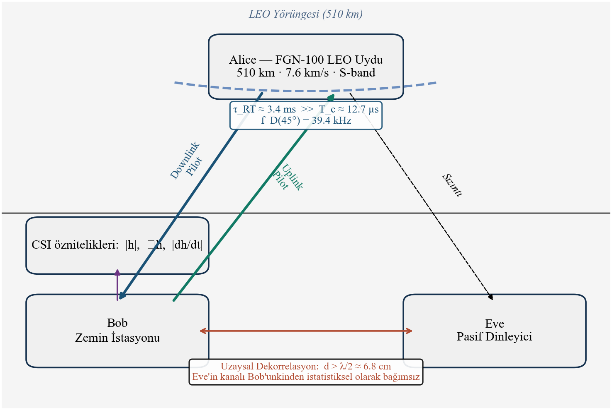
</p>

<h1 align="center">LEO Uydu-Zemin Fiziksel Katman Anahtar Uretimi</h1>

<h3 align="center">Yayilim Gecikmesi Farkindalikli Hibrit Guvenlik Mimarisi ve Eavesdropper Senaryolari</h3>

<p align="center">
  <strong>Onder Ozturk</strong><sup>1</sup> &nbsp;&middot;&nbsp; <strong>Huseyin Parmaksiz</strong><sup>2</sup>
</p>

<p align="center">
  <sup>1</sup> Kutahya Saglik Bilimleri Universitesi &nbsp;&middot;&nbsp; <sup>2</sup> Bilecik Seyh Edebali Universitesi
</p>

<p align="center">
  <a href="mailto:onder.ozturk@ksbu.edu.tr">onder.ozturk@ksbu.edu.tr</a> &nbsp;&middot;&nbsp;
  <a href="mailto:huseyin.parmaksiz@bilecik.edu.tr">huseyin.parmaksiz@bilecik.edu.tr</a>
</p>

<p align="center">
  <em>SAVTEK 2026 Konferansi Bildirisi</em>
</p>

---

## Problem

LEO uydu aglarinda **kanal tutarlilik suresi** (T_c ~ 12.7 us) ile **cift yonlu yayilim gecikmesi** (tau_RT ~ 3.4 ms) arasinda ~270 katlik bir ucurum vardir. Bu ucurum, klasik karsiliklilik (reciprocity) varsayimini gecersiz kilar ve fiziksel katman anahtar uretimini (PKG) dogrudan uygulanamaz hale getirir.

**Mevcut calismalardaki bosluk:** Literaturde yayilim gecikmesi farkindaligi, Cascade sizinti muhasebesi, HMAC tabanli anahtar evrimi ve ROC tabanli Eve tespitini bir arada ele alan bir calisma yoktur.

---

## Cozum: Uc Fazli Hibrit Mimari

<p align="center">
  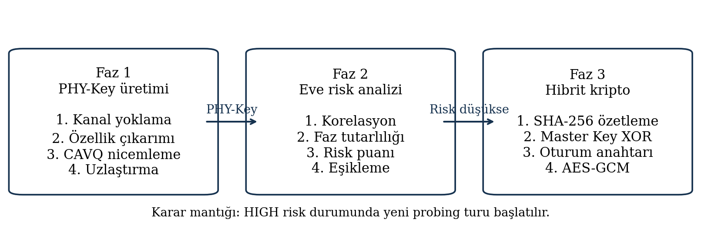
</p>

### Faz 1 -- PHY-Key Uretimi

Anlik CSI yerine **yavas degisen kanal oznitelikleri** (genlik zarfi, faz degisim hizi, Doppler orani) cikarilir. Bu oznitelikler, hizli CSI'ye kiyasla ~8800 kat daha yavas degisir ve yayilim gecikmesi olceginde karsilikliligini korur.

- **Oznitelik cikarimi:** Her CSI blogundan 3 yavas oznitelik (|h|, angle h, |dh/dt|)
- **AR(12) tahmini:** Yumusatilmis zarfin tau_RT kadar ilerideki degeri tahmin edilir
- **Nicemleme:** L=2 (dusuk SNR) veya L=3 (yuksek SNR) seviyeli medyan tabanli esikleme
- **Cascade uzlastirma:** 6 gecisli bit duzeltme (%99.9 duzeltme orani)
- **Gizlilik guclendirme:** Leftover Hash Lemma + SHA-256

<p align="center">
  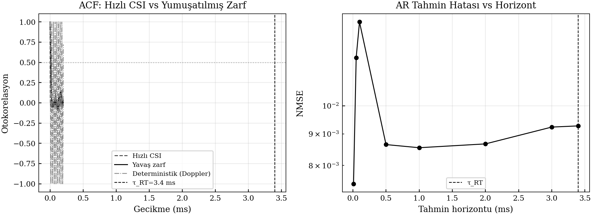
</p>
<p align="center"><em>Hizli CSI vs yumusatilmis zarf otokorelasyonu ve AR tahmin hatasi</em></p>

### Faz 2 -- ROC Tabanli Eve Tespiti

Eve risk skoru uc metrigin agirlikli bilesiminden hesaplanir:

```
R_E = w1 * rho_AE + w2 * PC_AE + w3 * sigma(delta_SNR_E)
```

Youden-J optimizasyonu ile esik degeri R_E* ~ 0.383 belirlenmistir. 20 dB ve 1 lambda icin P_FA = 0.044, P_MD = 0.020.

### Faz 3 -- HMAC Ratchet Anahtar Evrimi

PHY-Key, on-paylasimli ana anahtarla XOR birlestirilir. Ana anahtar her turda HMAC-SHA256 ile guncellenerek **ileri gizlilik (forward secrecy)** saglanir. Signal protokolundeki simetrik ratchet yapisindan esinlenmistir.

<p align="center">
  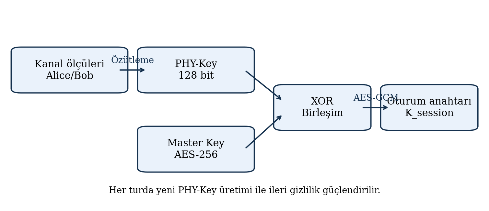
</p>
<p align="center"><em>PHY-Key ile HMAC ratchet anahtar evrimi</em></p>

---

## Kanal Modeli

**ITU-R P.681 Loo Modeli** kullanilmistir. DLR ve ESA saha olcum kampanyalariyla dogrulanmis olup elevasyon bagimli parametreleri dogrudan saglar.

| Parametre | Deger |
|-----------|-------|
| Uydu platformu | FGN-100 |
| Irtifa / orbital hiz | 510 km / 7.6 km/s |
| Tasiyici frekans | 2.2 GHz (S-band) |
| Bant genisligi | 10 MHz |
| Gecis suresi | ~5 dakika |
| SNR araligi | 10-30 dB |
| Monte-Carlo tekrari | 200 (tek-blok), 50 (tam gecis) |
| AR tahmin derecesi | p = 12 (BIC ile secilmis) |
| Cascade gecis sayisi | k = 6 |

---

## Sonuclar

### Ana Performans Metrikleri

<p align="center">
  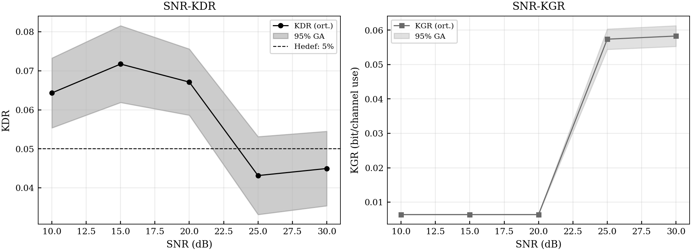
</p>
<p align="center"><em>Tek-blok senaryo: SNR-KDR (sol) ve SNR-KGR (sag), %95 guven araligi ile</em></p>

### Tam Uydu Gecisi (Loo Modeli)

<p align="center">
  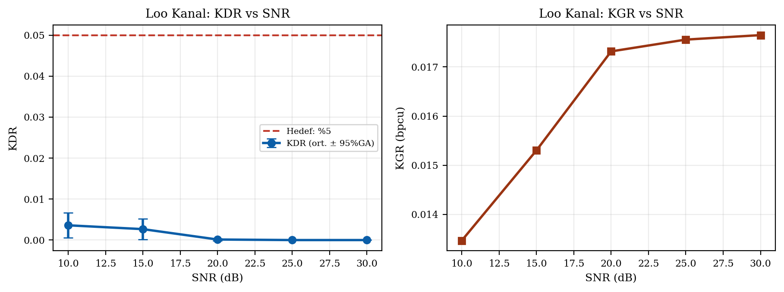
</p>

| SNR (dB) | Ham KDR | Cascade Sonrasi KDR | KGR (bpcu) | NIST |
|----------|---------|---------------------|------------|------|
| 10 | %4.5 | %0.4 | 0.014 | %100 |
| 15 | %3.0 | %0.3 | 0.015 | %98 |
| 20 | %1.1 | <%0.1 | 0.017 | %100 |
| 25 | %0.9 | <%0.1 | 0.018 | %98 |
| 30 | %0.9 | <%0.1 | 0.018 | %98 |

### Baseline Karsilastirmasi

<p align="center">
  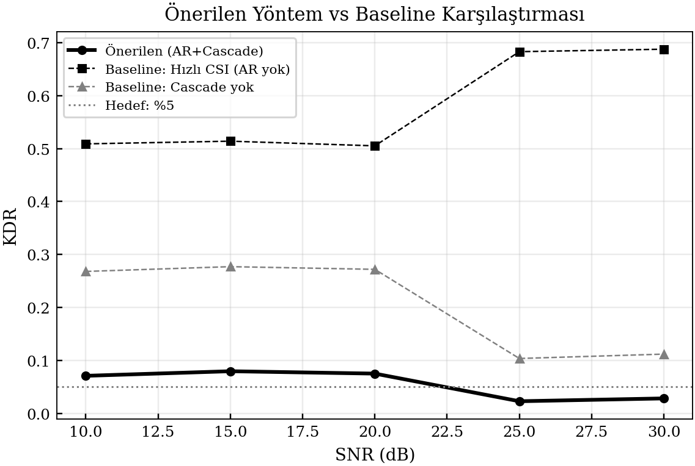
</p>

20 dB SNR'de:
- **Hizli CSI (baseline):** %50.5 KDR
- **Cascade yok (baseline):** %27.2 KDR
- **Onerilen yontem:** %6.7 KDR --> **7.5x iyilesme**

### Tam Gecis Geometrisi ve Otokorelasyon

<p align="center">
  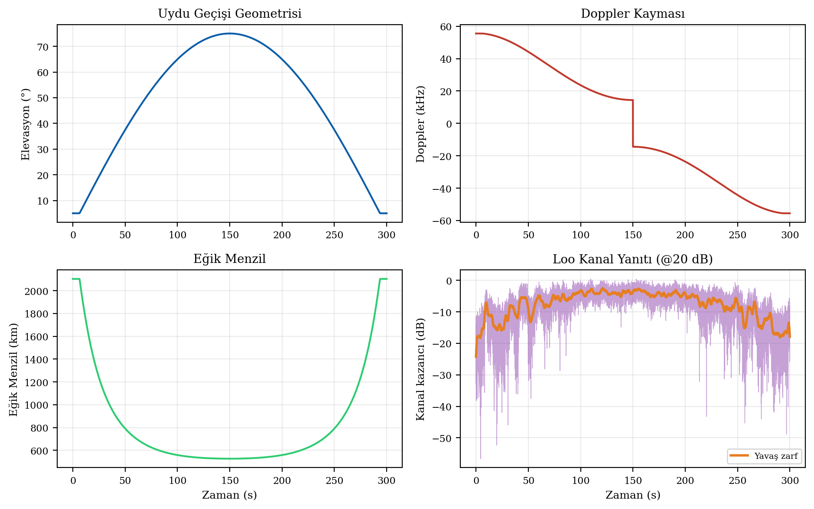
  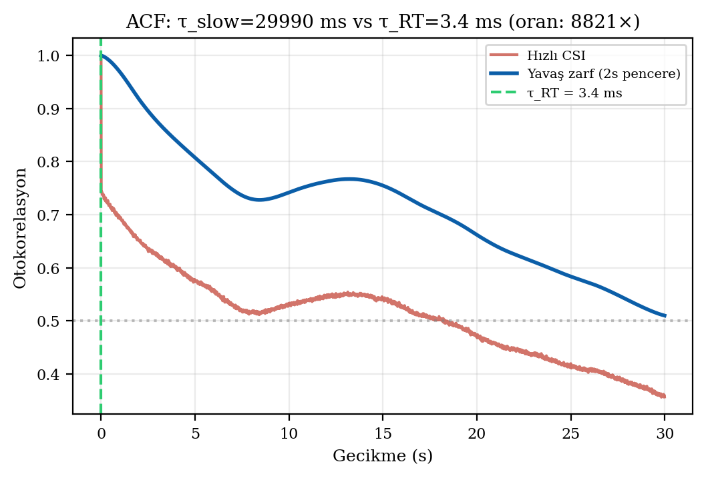
</p>

Yavas zarfin dekorelasyon suresi tau_slow ~ 30 s olup tau_RT'nin **~8800 kati** kadadir. Bu, yavas ozniteliklerin yayilim gecikmesi olceginde karsilikliligini korudugunu gostermektedir.

### Gizlilik Kapasitesi

<p align="center">
  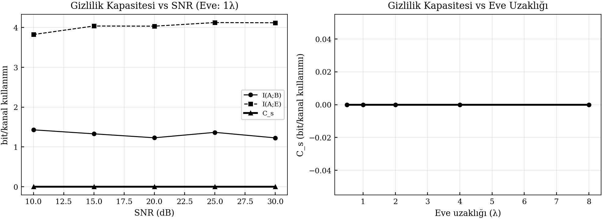
</p>

Gaussian yaklasimla C_s = I(A;B) - I(A;E) = 2.56 - 0.90 = **1.66 bpcu** pozitif gizlilik kapasitesi elde edilmistir.

### Eve Tespit Analizi

<p align="center">
  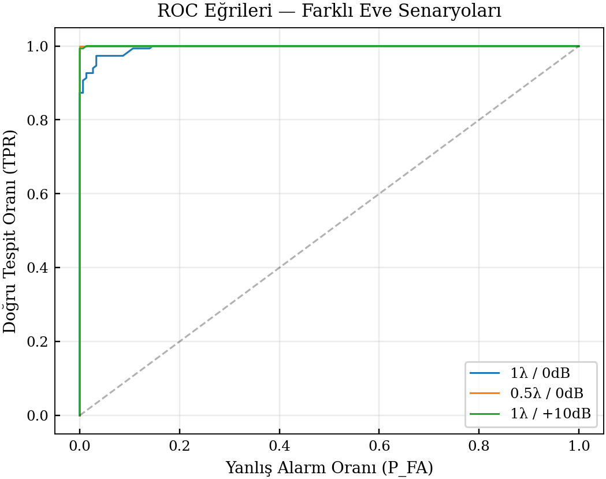
  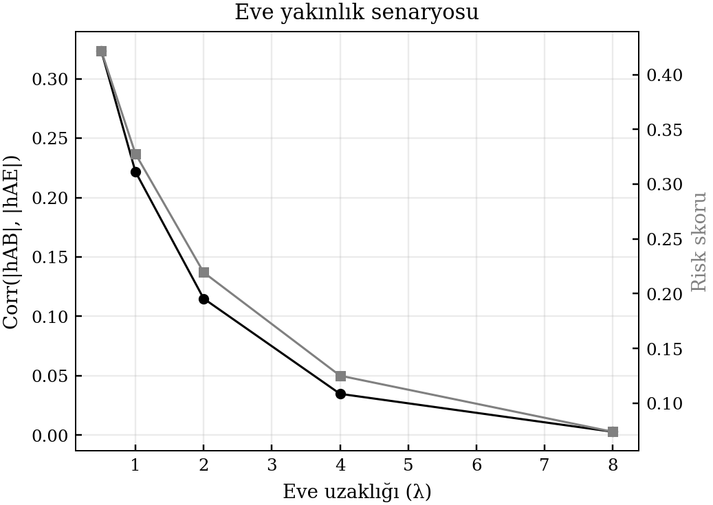
</p>

<p align="center">
  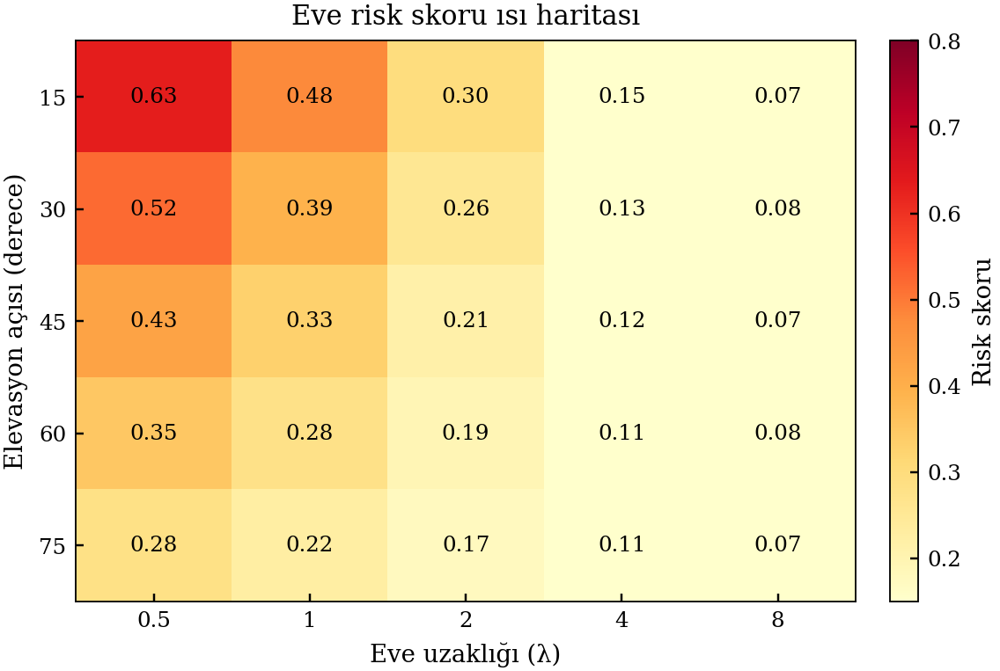
</p>
<p align="center"><em>Elevasyon-yakinlik risk skoru isi haritasi: dusuk elevasyon + yakin Eve = en yuksek risk</em></p>

---

## Literatur Karsilastirmasi

| Yontem | Kanal | KDR | KGR |
|--------|-------|-----|-----|
| Mathur vd. (2008) | WiFi | %2-4 | 1-10 bps |
| Jana vd. (2009) | WiFi | %1-5 | 1-22 bps |
| Oligeri vd. (2023) | LEO Doppler | %2-8 | ~250 bit/gecis |
| Topal vd. (2021) | Uzay Doppler | %5-15 | dusuk |
| **Bu calisma** | **LEO Loo** | **<%1** | **180 bit/gecis** |

---

## Kurulum ve Calistirma

### Gereksinimler

```bash
pip install numpy scipy matplotlib pandas
```

### Simulasyonu Calistirma

```bash
# Ana simulasyon
python leo_phy_sim.py

# Tum figurleri uret
cd ieee_latex
python generate_assets.py

# LaTeX derle
tectonic main.tex
```

### Sonuclari Inceleme

```python
import pandas as pd
import json

# Tek-blok KDR/KGR
df = pd.read_csv('ieee_latex/results/main_results.csv')
print(df)

# Eve uzaklik taramasi
df_eve = pd.read_csv('ieee_latex/results/eve_distance_results.csv')
print(df_eve)

# Tam gecis ozeti
with open('ieee_latex/results/pass_summary.json') as f:
    print(json.dumps(json.load(f), indent=2))
```

---

## Proje Yapisi

```
.
├── README.md
├── leo_phy_sim.py                       # Ana simulasyon kodu
├── ieee_latex/
│   ├── main.tex                         # LaTeX kaynak (IEEE formati)
│   ├── generate_assets.py               # Figur uretim + kanal simulasyonu
│   ├── satellite_pass_simulator.py      # Uydu gecis simulatoru
│   ├── figures/                         # 13 figur (PDF + PNG)
│   └── results/                         # Ham benzetim verileri
│       ├── main_results.csv             # Tek-blok KDR/KGR
│       ├── eve_distance_results.csv     # Eve uzaklik taramasi
│       ├── eve_heatmap.csv              # Elevasyon-yakinlik matrisi
│       ├── eve_snr_offset_results.csv   # Eve alici avantaji
│       ├── multi_elevation.csv          # Coklu elevasyon analizi
│       ├── pass_summary.json            # Tam gecis ozet metrikleri
│       └── summary.json                 # Genel benzetim ozeti
```

---

## Atif

```bibtex
@inproceedings{ozturk2026leo,
  title     = {LEO Uydu-Zemin Istasyonu Iletisiminde Yavas-Oznitelik 
               Tabanli Fiziksel Katman Anahtar Uretimi: Yayilim 
               Gecikmesi Farkindalikli Hibrit Guvenlik Modeli 
               ve Eavesdropper Senaryolari},
  author    = {Ozturk, Onder and Parmaksiz, Huseyin},
  booktitle = {SAVTEK 2026},
  year      = {2026}
}
```

---

<p align="center">
  <sub>Kutahya Saglik Bilimleri Universitesi &middot; Bilecik Seyh Edebali Universitesi</sub>
</p>
